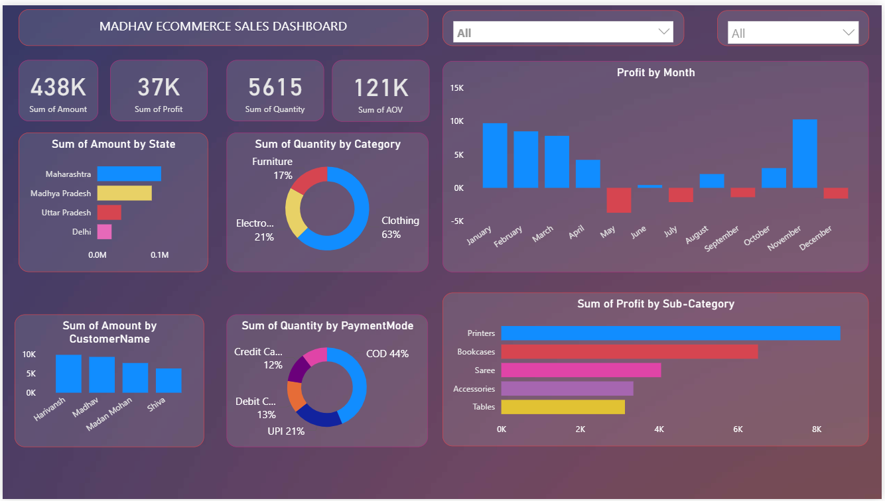

# 📊 E-commerce Sales Dashboard (Power BI)

## 🔍 Overview

This project showcases an interactive **E-commerce Sales Dashboard** built with **Power BI**. It provides a comprehensive view of sales performance across months, product categories, customers, states, and countries. The dashboard supports both **detailed drill-downs** and **overall summaries**, making it ideal for data-driven decision-making in e-commerce.

---

## 📸 Dashboard Preview

---

## ✅ Key Features

- 📅 **Month-wise Profit Analysis**  
  Track how profit evolves over time.

- 🌍 **Country & State-wise Sales**  
  Understand which regions generate the most revenue and profit.

- 🛒 **Category & Sub-category Performance**  
  Identify high-performing product groups.

- 💳 **Payment Mode Breakdown**  
  See which payment methods are preferred by customers.

- 👤 **Customer-wise Sales**  
  View top customers based on purchase volume or value.

- 📦 **Overall Business Metrics**  
  Monitor total quantity sold, revenue, and profitability at a glance.

---

## 🛠️ Tools & Skills Used

- **Power BI Desktop**
- **DAX (Data Analysis Expressions)**
- **Power Query Editor**
- **Data Cleaning & Transformation**
- **Data Visualization & Storytelling**
- **Business Intelligence Concepts**

---

## 📁 Dataset Details

The dataset includes:

- **Order Information**: Order Date, Product Category, Sub-Category  
- **Sales Details**: Sales Amount, Quantity, Profit  
- **Customer Info**: Name, State, Country  
- **Payment Details**: Mode of payment  

---

## 🎯 Insights

This dashboard enables stakeholders to:

- Make quick comparisons of monthly trends.
- Perform regional sales analysis.
- Identify popular products and top customers.
- Understand payment mode preferences.
- View both high-level and granular business insights.

